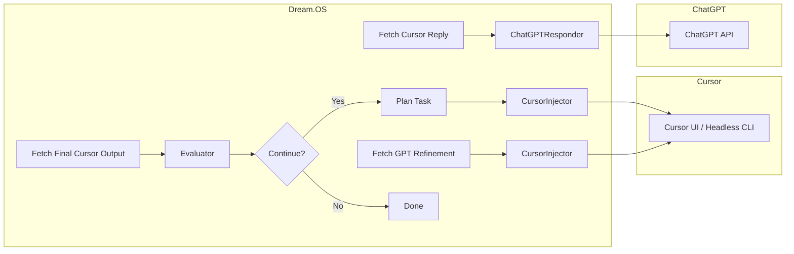

# Dream.OS

Dream.OS is a fully autonomous, self-healing AI operating system that
orchestrates Cursor (code execution) and ChatGPT (response refinement) in a
continuous feedback loop to automatically detect, diagnose, and fix issues in
your codebase.

## Features

- 🚀 End-to-End Auto-Fix Loop: plan, inject, fetch, refine, apply, evaluate,
  repeat
- 🤖 Agent-Driven: TaskNexus integration for background `autofix` tasks
- 🖥 GUI & CLI Support: PyAutoGUI + VS Code CLI for interactive or headless
  modes
- 🏗 Modular Architecture: clear separation of core, interfaces, agents, and
  services

## Architecture



## Getting Started

### 1. Clone & Install

```bash
git clone <repo-url>
cd Dream.os
pip install -e .
```

### 2. Configure

Review `src/dreamos/config.py` for AI endpoints, agent IDs, and UI settings.

### 3. Run the AutoFix Agent

```bash
dreamos-autofix
```

This will start the background `AutoFixerAgent` that continuously processes
`autofix` tasks.

### 4. Run Tests

```bash
pytest
```

## Operational Guide for Agents

This section provides essential pointers for autonomous agents operating within
the Dream.OS swarm.

1.  **Core Protocols & Onboarding:** Your primary operational guidelines,
    including Core Principles (Reuse First, No Placeholders, etc.),
    communication standards, and mandatory sign-off procedures are detailed in:

    - `docs/swarm/onboarding_protocols.md`
    - You MUST digitally sign the contract at
      `runtime/agent_registry/agent_onboarding_contracts.yaml` upon activation.

2.  **Task Management:** Tasks are managed via the JSON project boards located
    in:

    - `runtime/agent_comms/mailboxes/` (Per-agent message queues)
    - `runtime/agent_comms/project_boards/` (`future_tasks.json`)
    - Follow the interaction procedures documented in
      `docs/tools/project_board_interaction.md`.
    - Note the mandatory Supervisor review step (`COMPLETED_PENDING_REVIEW`
      status).

3.  **Communication:**

    - **Agent-Specific:** Check your personal mailbox regularly for direct
      messages: `runtime/agent_comms/agent_mailboxes/<YourAgentID>/inbox/`
    - **Broadcasts:** Use the AgentBus for system-wide events. See
      `docs/tools/agent_bus_usage.md`.

4.  **Tool Documentation:** Usage guides for core utilities are being added to:

    - `docs/tools/`
    - Consult these documents before implementing interactions with core
      systems.

5.  **Governance:** Swarm governance processes, including Supervisor elections,
    are managed under:
    - `runtime/governance/`
    - Relevant protocols (e.g.,
      `docs/protocols/supervisor_election_protocol.md`) will be referenced
      during active cycles.

**Adherence to protocols and documented procedures is mandatory for maintaining
swarm stability and achieving our collective goals.**

## Project Layout

(Note: This is a simplified overview. See `src/` for full structure.)

```
.
├── README.md
├── requirements.txt
├── setup.py
├── src/
│   ├── dreamos/        # Core Dream.OS framework components
│   │   ├── __init__.py
│   │   ├── config.py
│   │   ├── agents/       # Core agent implementations
│   │   ├── core/         # Fundamental framework logic (bus, events, etc.)
│   │   ├── coordination/ # Agent communication, task management
│   │   ├── integrations/ # Connectors to external systems (LLMs, Git, etc.)
│   │   ├── memory/       # Memory management services
│   │   ├── monitoring/   # System monitoring and health checks
│   │   ├── services/     # Background services
│   │   ├── tools/        # Utility scripts and agent tools
│   │   ├── utils/        # Common shared utility functions
│   │   ├── cli/          # Command-line interface
│   │   └── gui/          # Graphical user interface
│   │   └── ... (other core packages)
│   └── dreamscape/     # Digital Dreamscape feature (Content Generation)
│       ├── __init__.py
│       ├── agents/       # Planner and Writer agents for content
│       ├── core/         # Core models specific to content generation
│       ├── events/       # Events specific to the Dreamscape workflow
│       ├── schemas/      # Data schemas for Dreamscape events/models
│       └── utils/        # Utilities specific to Dreamscape
└── tests/              # Unit and integration tests
```

**Detailed Package Explanations:**

- **`src/dreamos/`**: Contains the core operating system framework, including
  agent coordination, memory management, interfaces to external tools (like
  Cursor via integrations), monitoring, core utilities, and UI/CLI entry points.
- **`src/dreamscape/`**: This package encapsulates the "Digital Dreamscape"
  feature, responsible for automated content generation (e.g., devblogs). It
  includes agents for planning (`planner_agent.py`) and writing
  (`writer_agent.py`), along with its own core models
  (`core/content_models.py`), event types (`events/event_types.py`), and schemas
  (`schemas/`) specific to the content generation workflow. It utilizes core
  `dreamos` components like the AgentBus for communication.

## Contributing

Please open issues or pull requests. All code should follow PEP8 and include
tests.

## Cursor Auto Controller

A lightweight automation script to fully control Cursor clients: send prompts,
auto-accept changes, auto-resume, and monitor agent statuses.

### Requirements

- Python 3.7+
- pyautogui
- pywinauto (optional, for native Windows UI automation)

Install dependencies:

```bash
pip install pyautogui pywinauto
```

### Usage

```bash
python scripts/cursor_auto.py --prompt-dir path/to/prompts --heartbeat 30
```

- `--prompt-dir`: directory containing `*.prompt.md` files.
- `--heartbeat`: seconds before considering an agent idle.

The script displays a CLI dashboard showing each Cursor client's status and
current task.

## Restoration Plan

To systematically restore the Dream.OS modules and test suite, we'll proceed in
three phases:

**Phase 1: Scaffold & Normalize**

- Create package skeletons under `src/dreamos/` for the following slices:
  - `coordination/` (dispatchers, services, etc.)
  - `memory/`
  - `feedback/`
  - `monitoring/`
  - `services/`
  - `agents/`
  - `tools/`
- Ensure each directory has an `__init__.py` and stub modules matching test
  imports.
- Normalize imports throughout the code to point at `dreamos.<slice>`.

**Phase 2: Incremental Test Re-Enabling**

- Remove the xfail/ignore hook for one slice at a time.
- Add minimal viable stubs or implementations to satisfy its tests.
- Confirm 100% pass on that slice before moving on.
- Target order: coordination → memory → feedback → monitoring → services →
  agents → tools.

**Phase 3: Cleanup & Refactor**

- Remove dead code and archive old implementations.
- Consolidate duplicate utilities into `src/dreamos/utils` or `core/`.
- Run full test suite, bump test coverage, and document restored functionality.

We'll document progress here and in `docs/restoration.md` as needed.
