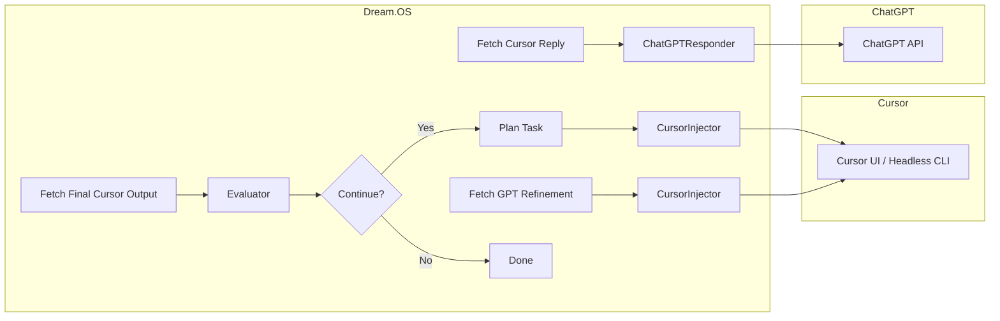

# Dream.OS

Dream.OS is a fully autonomous, self-healing AI operating system that orchestrates Cursor (code execution) and ChatGPT (response refinement) in a continuous feedback loop to automatically detect, diagnose, and fix issues in your codebase.

## Features

- 🚀 End-to-End Auto-Fix Loop: plan, inject, fetch, refine, apply, evaluate, repeat
- 🤖 Agent-Driven: TaskNexus integration for background `autofix` tasks
- 🖥 GUI & CLI Support: PyAutoGUI + VS Code CLI for interactive or headless modes
- 🏗 Modular Architecture: clear separation of core, interfaces, agents, and services

## Architecture



## Getting Started

### 1. Clone & Install
```bash
git clone <repo-url>
cd Dream.os
pip install -e .
```  

### 2. Configure
Review `src/dreamos/config.py` for AI endpoints, agent IDs, and UI settings.

### 3. Run the AutoFix Agent
```bash
dreamos-autofix
```  
This will start the background `AutoFixerAgent` that continuously processes `autofix` tasks.

### 4. Run Tests
```bash
pytest
```  

## Project Layout
```
.
├── README.md
├── requirements.txt
├── setup.py
├── src/
│   └── dreamos/
│       ├── __init__.py
│       ├── config.py
│       ├── agent_utils.py
│       ├── orchestrator.py
│       ├── cursor_interface.py
│       ├── chatgpt_interface.py
│       ├── evaluator.py
│       ├── agents/
│       │   ├── __init__.py
│       │   └── autofix_agent.py
│       └── services/
│           ├── __init__.py
│           └── autofix_service.py
└── tests/
    ├── test_orchestrator.py
    └── test_autofix_agent.py
```

## Contributing
Please open issues or pull requests. All code should follow PEP8 and include tests. 

## Cursor Auto Controller

A lightweight automation script to fully control Cursor clients: send prompts, auto-accept changes, auto-resume, and monitor agent statuses.

### Requirements
- Python 3.7+
- pyautogui
- pywinauto (optional, for native Windows UI automation)

Install dependencies:
```bash
pip install pyautogui pywinauto
```

### Usage
```bash
python scripts/cursor_auto.py --prompt-dir path/to/prompts --heartbeat 30
```

- `--prompt-dir`: directory containing `*.prompt.md` files.
- `--heartbeat`: seconds before considering an agent idle.

The script displays a CLI dashboard showing each Cursor client's status and current task.

## Restoration Plan

To systematically restore the Dream.OS modules and test suite, we'll proceed in three phases:

**Phase 1: Scaffold & Normalize**
- Create package skeletons under `src/dreamos/` for the following slices:
  - `coordination/` (dispatchers, services, etc.)
  - `memory/`
  - `feedback/`
  - `monitoring/`
  - `services/`
  - `agents/`
  - `tools/`
- Ensure each directory has an `__init__.py` and stub modules matching test imports.
- Normalize imports throughout the code to point at `dreamos.<slice>`.

**Phase 2: Incremental Test Re-Enabling**
- Remove the xfail/ignore hook for one slice at a time.
- Add minimal viable stubs or implementations to satisfy its tests.
- Confirm 100% pass on that slice before moving on.
- Target order: coordination → memory → feedback → monitoring → services → agents → tools.

**Phase 3: Cleanup & Refactor**
- Remove dead code and archive old implementations.
- Consolidate duplicate utilities into `src/dreamos/utils` or `core/`.
- Run full test suite, bump test coverage, and document restored functionality.

We'll document progress here and in `docs/restoration.md` as needed.