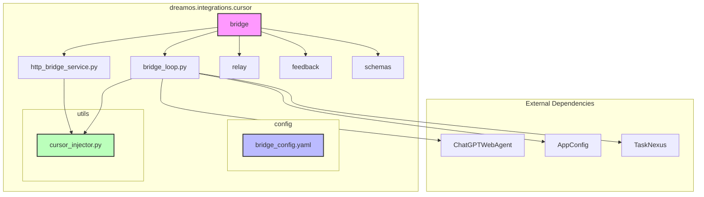

# Cursor Bridge Module Diagram

## Module Descriptions

### Core Components
- **bridge_loop.py**: Main orchestrator for the bridge functionality
- **http_bridge_service.py**: FastAPI service for HTTP-based bridge interactions
- **relay/**: Handles message relay between systems
- **feedback/**: Manages feedback mechanisms
- **schemas/**: Contains data structure definitions

### Configuration
- **bridge_config.yaml**: Primary configuration file for bridge settings

### Utilities
- **cursor_injector.py**: Handles Cursor IDE interaction via PyAutoGUI

### Dependencies
- **ChatGPTWebAgent**: Manages ChatGPT web UI interactions
- **AppConfig**: Application-wide configuration management
- **TaskNexus**: Task management and coordination

## Data Flow
1. Input prompts are received via HTTP or file system
2. Bridge loop processes prompts through ChatGPTWebAgent
3. Responses are captured and stored
4. Feedback and relay systems handle communication flow 