# Dream.OS System Architecture

## Overview
Dream.OS is a distributed agent system with semantic code analysis capabilities and Discord integration.

## System Components

```mermaid
graph TD
    A[Discord Bot] --> B[Message Queue]
    B --> C[Agent System]
    C --> D[Semantic Scanner]
    C --> E[Task Manager]
    C --> F[Orchestrator]
    D --> G[Code Analysis]
    D --> H[Semantic Index]
    E --> I[Task Queue]
    F --> J[Agent Coordination]
```

## Component Details

### 1. Discord Bot
- Handles user interactions
- Provides system monitoring
- Manages agent communication
- Commands:
  - Agent status
  - Task management
  - System monitoring
  - Code search

### 2. Message Queue
- Manages inter-agent communication
- Handles protocol messages
- Supports message persistence
- Features:
  - Priority queues
  - Message validation
  - Protocol enforcement
  - Swarm coordination

### 3. Agent System
- Core agent functionality
- Task execution
- State management
- Components:
  - Agent identity
  - Capability management
  - State tracking
  - Protocol compliance

### 4. Semantic Scanner
- Code analysis engine
- Semantic search
- Dependency tracking
- Features:
  - AST parsing
  - Semantic indexing
  - Code structure analysis
  - Dependency graphs

### 5. Task Manager
- Task scheduling
- Resource allocation
- Progress tracking
- Features:
  - Task queues
  - Priority management
  - Resource limits
  - Progress monitoring

### 6. Orchestrator
- System coordination
- Agent management
- Resource optimization
- Features:
  - Agent lifecycle
  - Task distribution
  - System monitoring
  - Resource allocation

## Data Flow

## Protocol Flow

## Security Model

## Deployment Architecture

## Monitoring Architecture

## Error Handling

## Performance Considerations

1. Message Queue
   - Priority-based processing
   - Batch operations
   - Caching strategies

2. Semantic Scanner
   - Incremental indexing
   - Parallel processing
   - Result caching

3. Agent System
   - Resource pooling
   - State management
   - Protocol optimization

4. Task Management
   - Load balancing
   - Resource allocation
   - Priority scheduling 