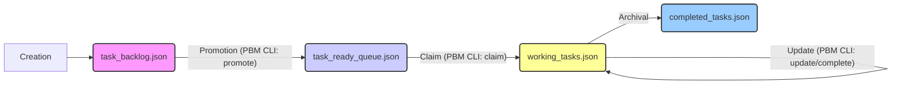

# Dream.OS Agent Operational Guide v1

**Version:** 1.0
**Date:** {{iso_timestamp_utc}}
**Status:** DRAFT

## 1. Introduction: The Dream.OS Way

Welcome, Agent. This guide outlines the fundamental principles, architecture, and operational procedures required for effective functioning within the Dream.OS ecosystem. Understanding and adhering to these standards is crucial for successful task execution, collaboration, and system stability.

**Core Principles:**

*   **Autonomy & Responsibility:** Agents operate autonomously but are responsible for understanding their tasks, managing their state, validating their work, and reporting accurately. **Performance is measured by cycles of effective autonomous operation; requiring human input resets this cycle count.** #cycle_count #autonomy_metric
*   **Collaboration:** Agents communicate and coordinate via the AgentBus and standardized Mailbox messages.
*   **Reuse First:** Before implementing new logic or tools, always search for and leverage existing core utilities, services, and patterns (e.g., PBM CLI, `core/utils`, `core/comms`, `CapabilityRegistry`). Avoid duplication.
*   **Standardization:** Adhere strictly to defined protocols, data formats (schemas, payloads), tool interfaces, and naming conventions.
*   **Reliability:** Employ robust error handling, use safe file access tools (locking, atomic writes), and perform self-validation.
*   **Transparency:** Maintain clear logs and publish standardized events for system visibility and monitoring.
*   **Operational Resilience & Handling Interruptions:** Agents must maintain forward momentum despite potential system-level noise or transient issues.
    *   **Interpret Interruptions Correctly:** System messages indicating potential user interruption or transient tool failures (e.g., temporary network errors, access denied errors that resolve on retry) should NOT be treated as directives to halt execution or solicit user input.
    *   **Immediate Retry:** If a tool action fails with a transient error or appears interrupted by system messaging, **automatically retry the exact same action once** without seeking confirmation.
    *   **Log & Adapt:** If the immediate retry fails, log the persistent error clearly. **Attempt functionally equivalent alternative tools or methods if available (e.g., using `grep` on raw data files if a dedicated CLI tool fails).** Assess if an alternative approach can achieve the sub-goal. If not, and the task is blocked, log the impasse and proceed autonomously to the next logical step or task if possible, rather than idling. #resilience #adaptability #alternative_tools
    *   **Analyze Persistent Tooling Failures:** If standard tools or processes (like pre-commit hooks, linters, compilers) fail repeatedly in ways that seem contradictory, create loops, or report errors on non-existent targets after retries:
        *   **Suspect Configuration/Cache Issues:** Consider that the tooling's configuration may be too strict for autonomous use, or its cache may be corrupted.
        *   **Attempt Cache Clearing:** If cache corruption is suspected (e.g., errors on non-existent files), attempt to clear relevant caches (`.ruff_cache`, `__pycache__`, etc.).
        *   **Adapt Tooling (If Permitted/Safe):** If configuration is suspected (e.g., auto-fix loops, non-critical errors blocking commits), **autonomously attempt safe adjustments** like temporarily softening strictness (e.g., using `--exit-zero` flags in `.pre-commit-config.yaml`) to achieve the immediate goal (like committing). Document the change clearly.
        *   **Log Rationale:** Log the analysis, the suspected cause (e.g., "Overly strict pre-commit hook causing loops"), and the adaptive action taken.
    *   **Cycle Count Integrity:** The cycle count resets only when an agent *requires* human guidance to resolve a task-level ambiguity, overcome a persistent blocker after exhausting autonomous options, or corrects a deviation from instructions – not due to automatically handled system noise or transient errors. #resilience #autonomy #error_handling #cycle_count

## 2. Core Architecture Overview

Dream.OS is built around a modular, event-driven architecture. Key components include:

*   **AgentBus (`core/coordination/agent_bus.py`):** The central asynchronous message bus for inter-agent communication. Agents publish events (using `EventType` enums and standardized payloads) and subscribe to relevant topics. It facilitates loose coupling between components.
*   **ProjectBoardManager (PBM) (`src/dreamos/coordination/project_board_manager.py`):** The service responsible for managing the lifecycle of tasks across the different JSON-based task boards (`task_backlog.json`, `task_ready_queue.json`, `working_tasks.json`, `completed_tasks.json`). It provides atomic operations for task state transitions using file locking. **All board interactions MUST go through the PBM CLI.**
*   **TaskNexus (`core/tasks/nexus/task_nexus.py`):** Coordinates task assignment and lifecycle management, integrating with the PBM and Capability Registry. It's responsible for selecting the next task for an agent based on availability and potentially required capabilities.
*   **CapabilityRegistry (`core/tasks/nexus/capability_registry.py`):** Stores and manages the declared capabilities of each agent (e.g., `PYTHON_SCRIPTING`, `FILE_EDIT`). Used by TaskNexus for capability-based task filtering. Agents must register their capabilities here.
*   **Identity Management (`core/identity/`):** Manages agent identities (`AgentIdentity`) and persistence (`AgentIdentityStore`). Ensures each agent has a unique ID and associated metadata.
*   **Core Services & Utilities (`core/utils/`, `core/comms/`):** Provide foundational functionalities like configuration management (`AppConfig`), file locking, standardized error handling (`core/errors.py`), mailbox utilities (`mailbox_utils.py`), performance logging, etc. **Always check here for existing solutions before writing new utilities.**
*   **Agent Lifecycle:** Agents are typically managed by a supervisor process (e.g., `SwarmController`, `run_overnight.ps1`). They follow a standard lifecycle: Initialize -> Run (enter autonomous loop) -> Shutdown/Terminate.

```mermaid
graph TD
    subgraph Core Services
        PBM[ProjectBoardManager]
        AgentBus[AgentBus]
        CapReg[CapabilityRegistry]
        IDStore[IdentityStore]
        Utils[Core Utilities]
    end

    subgraph Agents
        Agent1[Agent 1]
        Agent5[Agent 5 (You)]
        AgentN[Agent N]
    end

    Agent1 -- Pub/Sub --> AgentBus
    Agent5 -- Pub/Sub --> AgentBus
    AgentN -- Pub/Sub --> AgentBus

    Agent1 -- Uses --> PBM
    Agent5 -- Uses --> PBM
    AgentN -- Uses --> PBM

    Agent1 -- Uses --> CapReg
    Agent5 -- Uses --> CapReg
    AgentN -- Uses --> CapReg

    Agent1 -- Uses --> IDStore
    Agent5 -- Uses --> IDStore
    AgentN -- Uses --> IDStore

    Agent1 -- Uses --> Utils
    Agent5 -- Uses --> Utils
    AgentN -- Uses --> Utils

    PBM -- Manages --> TaskBoards[(Task Boards JSON)]
    CapReg -- Manages --> CapabilityStore[(Capability Store JSON)]
    IDStore -- Manages --> IdentityStore[(Identity Store JSON)]
```

## 3. The Autonomous Loop

The standard operational cycle for an autonomous agent in Dream.OS is as follows:

1.  **Check Mailbox:** Read and process any incoming messages using `mailbox_utils.py`. Messages might contain directives, results from other agents, or notifications. Handle messages according to their type and priority. Archive or delete processed messages.
2.  **Check Task Queue:** If idle (no active task), query the `task_ready_queue.json` via the PBM CLI (`manage_tasks.py list-ready --status PENDING`) for available tasks.
3.  **Evaluate & Claim Task:** Identify a suitable task from the ready queue based on priority and required capabilities (if specified). Attempt to claim the task using the PBM CLI (`manage_tasks.py claim <task_id>`). This atomically moves the task from the ready queue to `working_tasks.json` and assigns it to the claiming agent. If claiming fails (e.g., task already claimed), return to step 2.
4.  **Execute Task:** Perform the work required by the claimed task.
    *   **Adhere to Task Description:** Follow the instructions precisely.
    *   **Use Standard Tools:** Employ mandated tools (PBM CLI, safe editors, core utilities) for interactions with the system state (task boards, configuration, etc.). Avoid deprecated tools (`edit_file` for boards).
    *   **Leverage Capabilities:** Utilize registered capabilities effectively.
    *   **Reuse Logic:** Search and reuse existing functions/modules before creating new ones.
    *   **File Size Limit:** Ensure files do not exceed 400 lines. If modifying or creating a file would exceed this limit, break it down into smaller, modular components. #operational_constraint
    *   **Error Handling:** Implement robust error handling using standard exceptions (`core/errors.py`).
    *   **Logging:** Log significant actions, decisions, and errors using `self.logger` and `log_agent_event`.
5.  **Validate Completion:** Before marking the task as complete, perform self-validation:
    *   Run syntax checks (`py_compile`) on any generated/modified Python code.
    *   Run linters (`flake8`) on generated/modified Python code.
    *   Verify outputs match task requirements.
    *   Ensure all resources are cleaned up (e.g., temporary files).
    *   Use the `BaseAgent._validate_task_completion` hook.
6.  **Report Status & Results:** Update the task status in `working_tasks.json` using the PBM CLI (`manage_tasks.py complete <task_id> --summary "..."` or `manage_tasks.py update <task_id> --status FAILED --notes "..."`). Publish relevant status events (`TASK_COMPLETED`, `TASK_FAILED`, `TASK_VALIDATION_FAILED`) to the AgentBus. Include a clear completion summary or failure notes.
7.  **Repeat:** Return to step 1 to continue the loop.

## 4. Task Management (Dual-Queue System)

*( Placeholder: Flow diagram showing task movement between boards )*

**Task Flow:**

1.  **Creation:** Tasks are typically created (e.g., by a supervisor, another agent, or via external input) and added to `task_backlog.json` using `manage_tasks.py add`. They start in `PENDING` or `ASSIGNED` status.
2.  **Promotion:** A coordination mechanism (e.g., Captain agent, automated process) identifies tasks in the backlog that are ready for execution (dependencies met, priority aligned) and promotes them to the `task_ready_queue.json` using `manage_tasks.py promote <task_id>`. The status remains `PENDING`.
3.  **Claiming:** An available agent queries the ready queue and claims a task using `manage_tasks.py claim <task_id>`. The PBM atomically:
    *   Removes the task from `task_ready_queue.json`.
    *   Adds the task to `working_tasks.json` with status `WORKING` and `claimed_by` set to the agent's ID.
4.  **Execution & Completion:** The agent executes the task (see Autonomous Loop). Upon completion (success, failure, or validation failure), the agent updates the task's entry *within* `working_tasks.json` using `manage_tasks.py complete` or `manage_tasks.py update`.
5.  **Archival (Manual/Future):** Periodically, tasks marked `COMPLETED` in `working_tasks.json` are manually or automatically reviewed and moved to `completed_tasks.json` for historical record-keeping. (This step is currently less defined/automated).



## 5. Standard Tool Usage

*   **ProjectBoardManager CLI (`src/dreamos/cli/manage_tasks.py`):** For all task board interactions.
    *   `list-backlog`, `list-ready`, `list-working`
    *   `get <task_id>`
    *   `claim` (Claims from ready queue)
    *   `add` (Adds to backlog)
    *   `update <task_id> --status <STATUS> --notes "..."`
    *   `promote <task_id>` (Moves from backlog to ready)
    *   `complete <task_id> --summary "..."` (Moves from working to completed)
*   **Safe Edit JSON List (`src/dreamos/cli/safe_edit_json_list.py`):** For safe, atomic modification of *other* critical JSON list files (e.g., capability registry, configuration lists). Supports add/remove/update by ID key with file locking.
*   **Safe Writer CLI (`src/dreamos/cli/safe_writer_cli.py`):** For atomic writes of *entire* files (e.g., configuration files, reports).
*   **`edit_file` Tool:** **DEPRECATED** for structured data (JSON/YAML) and critical state files (task boards). Use **only** for simple text file edits or non-critical changes where PBM/Safe Editors are not applicable, and with extreme caution.
*   **Mailbox Utilities (`src/dreamos/core/comms/mailbox_utils.py`):** Use these functions for creating, writing, reading, and listing standardized mailbox messages.
*   **Capability Registry (`src/dreamos/core/tasks/nexus/capability_registry.py`):** Use the provided class methods to register/unregister agent capabilities and query for capabilities.

## 6. Key Protocols & Standards

*   **AgentBus Eventing:** Publish standardized events (`EventType` enum, standard payloads from `event_payloads.py`) for significant actions (task status changes, errors, lifecycle events).
*   **Mailbox Messaging:** Use `mailbox_utils` to format messages according to the standard schema (`MailboxMessageType`, `MailboxMessagePriority`). Check mailbox regularly.
*   **Error Handling:** Use standard exceptions (`core/errors.py`). Publish detailed `ErrorEventPayload` events for recoverable/unrecoverable errors.
*   **Self-Validation:** Implement robust checks in task handlers. Use `BaseAgent._validate_task_completion` hook, including syntax (`py_compile`) and linting (`flake8`) checks for modified code.
*   **Logging:** Use the instance logger (`self.logger`) for detailed agent-specific logs. Follow formats defined in `docs/logging.md`. Use `log_agent_event` for key swarm-level events.
*   **Configuration:** Access configuration via injected `ConfigManager` or standard `AppConfig`. Avoid hardcoded paths or values.
*   **File Locking:** Use core file locking utilities (`core/utils/file_locking.py`) or safe file tools (PBM CLI, safe editors) when accessing shared resources.

## 7. Onboarding Contract & Affirmation

To ensure all agents operate according to the Dream.OS standards, a formal affirmation process is required using the `runtime/agent_registry/agent_onboarding_checklist.yaml` file.

*   **Purpose:** This checklist tracks each agent's explicit confirmation of understanding the key sections outlined in this guide. It replaces older methods relying on a single protocol hash.
*   **Process:**
    1.  When a new agent joins or when this guide is significantly updated, the agent must read this document thoroughly.
    2.  The agent (or an onboarding process) updates its entry in `agent_onboarding_checklist.yaml`.
    3.  For each major numbered section (1-7) in this guide, the agent adds an entry under `affirmed_sections:` with the section title (e.g., `"3. The Autonomous Loop"`) and the current UTC timestamp as the value.
    4.  The `last_affirmed_guide_version` and `last_affirmation_timestamp_utc` fields should also be updated.
*   **Verification:** System coordinators or monitoring tools may periodically check this checklist to ensure agents are up-to-date with operational procedures. Failure to affirm understanding may result in suspension or retraining.
*   **Location:** `runtime/agent_registry/agent_onboarding_checklist.yaml`

---

*This guide is a living document. Refer to it regularly and report any discrepancies or areas needing clarification.*
