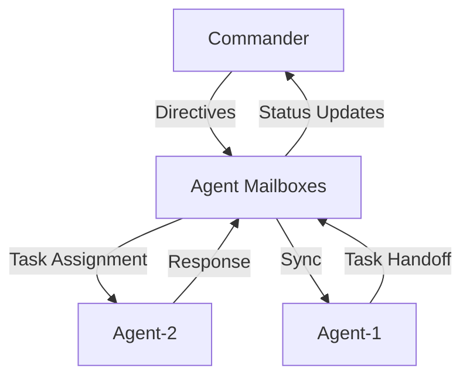
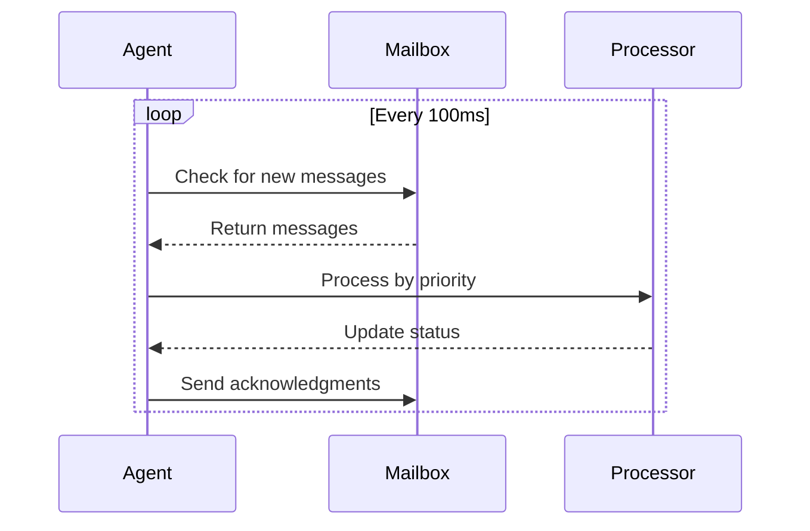

# Dream.OS Messaging Protocol

## Overview

The Dream.OS messaging protocol defines the standard for all inter-agent communication, ensuring reliable, consistent, and machine-parsable message exchange. This protocol is implemented through a file-based inbox system located at `runtime/agent_mailboxes/<AgentID>/inbox.json`.

## 1. Message Structure

### 1.1 Core Schema

```json
{
  "message_id": "uuid-v4-string",
  "type": "MESSAGE_TYPE",
  "sender_id": "Agent-X",
  "recipient_id": "Agent-Y",
  "timestamp": "ISO-8601-UTC",
  "priority": "PRIORITY_LEVEL",
  "content": {
    "subject": "Brief summary",
    "body": "Main message content",
    "metadata": {
      "requires_ack": true,
      "expires": "ISO-8601-UTC",
      "related_files": []
    }
  },
  "in_response_to": "optional-parent-message-id"
}
```

### 1.2 Message Types

| Type | Description | Priority | Example Use |
|------|-------------|----------|-------------|
| `TASK` | Task assignment/handoff | HIGH | Task delegation between agents |
| `STATUS` | Status updates | LOW | Progress reports, health checks |
| `BLOCKER` | Blocking issues | HIGH | Error reports, dependency blocks |
| `COMMAND` | Direct instructions | HIGH | Protocol enforcement, directives |
| `RESPONSE` | Reply to queries | MEDIUM | Task completion, query answers |
| `PROTOCOL` | Protocol messages | HIGH | Protocol updates, compliance |
| `SYNC` | Synchronization | MEDIUM | State sync, coordination |
| `ALERT` | Critical notifications | HIGH | System alerts, emergencies |
| `BOOTSTRAP` | Agent initialization | HIGH | Agent startup, capability registration |
| `SWARM_JOIN` | Swarm coordination | HIGH | Agent joining swarm |
| `SWARM_LEAVE` | Swarm coordination | HIGH | Agent leaving swarm |
| `FACILITATE` | Facilitation commands | HIGH | Agent coordination tasks |

### 1.3 Priority Levels

| Level | Description | Processing Order | Example |
|-------|-------------|-----------------|---------|
| `HIGH` | Critical messages | Immediate | System alerts, commands |
| `MEDIUM` | Normal priority | Standard FIFO | Task assignments, responses |
| `LOW` | Background tasks | After higher priority | Status updates, logs |

## 2. Routing System

### 2.1 Message Flow



### 2.2 Processing Rules

1. **Priority-Based Processing**
   - Higher priority messages are processed first
   - Within same priority, FIFO (First In, First Out)
   - Critical messages (HIGH) may interrupt current processing

2. **Acknowledgment Requirements**
   - Messages with `requires_ack: true` must be acknowledged
   - Acknowledgment must be sent within 5 seconds
   - Retry mechanism for unacknowledged messages

3. **Message Expiration**
   - Messages with `expires` timestamp are ignored after expiration
   - Expired messages are archived, not deleted
   - Default expiration: 24 hours for non-critical messages

## 3. Agent Loop Behavior

### 3.1 Message Processing Loop



### 3.2 Error Handling

- Failed message processing is logged
- Retry mechanism for failed deliveries
- Dead letter queue for undeliverable messages
- Automatic recovery from processing errors

## 4. CLI Usage

### 4.1 Basic Commands

```bash
# Send a message
dreamos message send \
  --to Agent-1 \
  --type TASK \
  --priority HIGH \
  --content '{"subject": "New Task", "body": "Process data"}' \
  --requires-ack

# Check mailbox
dreamos message list --agent Agent-1

# Acknowledge message
dreamos message ack --id <message-id>

# Monitor messages
dreamos message monitor --agent Agent-1
```

### 4.2 Examples

1. **Task Assignment**
```bash
dreamos message send \
  --to Agent-2 \
  --type TASK \
  --priority HIGH \
  --content '{
    "subject": "Process Dataset",
    "body": {
      "task_id": "TASK-123",
      "action": "process_data",
      "parameters": {
        "dataset": "data.csv",
        "format": "json"
      }
    }
  }'
```

2. **Status Update**
```bash
dreamos message send \
  --to Commander \
  --type STATUS \
  --priority LOW \
  --content '{
    "subject": "Task Progress",
    "body": {
      "task_id": "TASK-123",
      "status": "in_progress",
      "progress": 75
    }
  }'
```

3. **Protocol Message**
```bash
dreamos message send \
  --to all \
  --type PROTOCOL \
  --priority HIGH \
  --content '{
    "subject": "Protocol Update",
    "body": {
      "protocol": "MESSAGING",
      "version": "2.0",
      "changes": ["New priority levels", "Enhanced routing"]
    }
  }'
```

## 5. Best Practices

1. **Message Creation**
   - Always include required fields
   - Use appropriate priority levels
   - Set expiration for non-critical messages
   - Include relevant metadata

2. **Processing**
   - Handle messages in priority order
   - Implement proper error handling
   - Log all message operations
   - Monitor message queues

3. **Security**
   - Validate all incoming messages
   - Sanitize message content
   - Implement rate limiting
   - Monitor for abuse

4. **Performance**
   - Keep messages concise
   - Use appropriate priority levels
   - Implement message batching when possible
   - Monitor queue sizes

## 6. References

- [Message Protocol Implementation](../src/dreamos/tools/message_protocol.py)
- [Message Validator](../src/dreamos/tools/message_validator.py)
- [Message Schema](../src/dreamos/agents/message_schema.py)
- [Message Queue CLI](../src/dreamos/tools/message_queue_cli.py) 