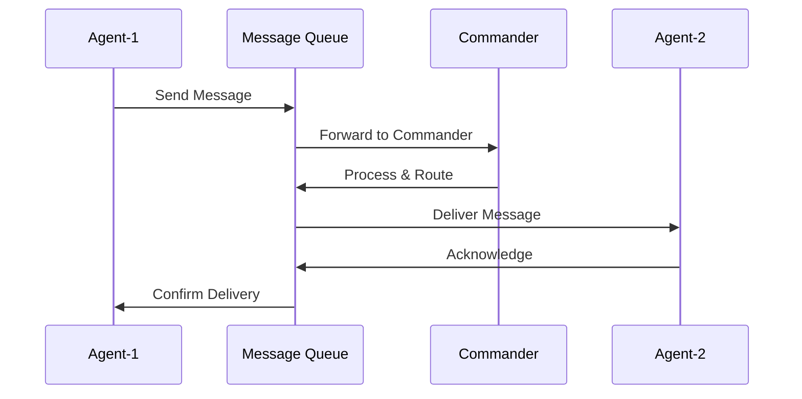

# Agent Messaging Protocol

## Overview
The Agent Messaging Protocol defines the standard communication contract between agents, developers, and Commander tools in the Dream.OS system. This protocol ensures consistent message handling, validation, and processing across all components.

## Message Schema

### Base Message Structure
```python
{
    "id": str,                    # Unique message identifier
    "type": MessageType,          # Message type (enum)
    "content": Dict[str, Any],    # Message content
    "priority": MessagePriority,  # Message priority (enum)
    "timestamp": str,             # ISO format timestamp
    "status": str,                # Message status
    "from_agent": Optional[str],  # Sender agent ID
    "to_agent": Optional[str],    # Recipient agent ID
    "metadata": Optional[Dict]    # Additional metadata
}
```

### Message Types
```python
class MessageType(Enum):
    # Core Types
    SYNC = "SYNC"           # Synchronization message
    RESUME = "RESUME"       # Resume operation message
    ALERT = "ALERT"         # Alert/notification message
    RETRY = "RETRY"         # Retry operation message
    TASK = "TASK"          # Task assignment message
    STATUS = "STATUS"      # Status update message
    HEALTH = "HEALTH"      # Health check message
    COORD = "COORD"        # Coordination message
    CELL = "CELL"          # Cell phone message
    RESPONSE = "RESPONSE"  # Agent response message

    # Cellphone/Bootstrapper Types
    BOOTSTRAP = "BOOTSTRAP"    # Bootstrap initialization
    SWARM_JOIN = "SWARM_JOIN"  # Agent joining swarm
    SWARM_LEAVE = "SWARM_LEAVE" # Agent leaving swarm
    PROTOCOL = "PROTOCOL"      # Protocol instruction/update
    DREAM_OS = "DREAM_OS"      # Dream.OS specific operations
    FACILITATE = "FACILITATE"  # Facilitation commands

    # Protocol Types
    PROTOCOL_ACK = "PROTOCOL_ACK"         # Protocol acknowledgment
    PROTOCOL_ERROR = "PROTOCOL_ERROR"     # Protocol error
    PROTOCOL_UPDATE = "PROTOCOL_UPDATE"   # Protocol update
    PROTOCOL_SYNC = "PROTOCOL_SYNC"       # Protocol synchronization
    PROTOCOL_CHECK = "PROTOCOL_CHECK"     # Protocol compliance check
    PROTOCOL_REPORT = "PROTOCOL_REPORT"   # Protocol compliance report
    PROTOCOL_ENFORCE = "PROTOCOL_ENFORCE" # Protocol enforcement
    PROTOCOL_VIOLATION = "PROTOCOL_VIOLATION"   # Protocol violation
    PROTOCOL_REMEDIATE = "PROTOCOL_REMEDIATE"   # Protocol remediation
    PROTOCOL_AUDIT = "PROTOCOL_AUDIT"     # Protocol audit

    # Swarm Types
    SWARM_SYNC = "SWARM_SYNC"           # Swarm synchronization
    SWARM_CHECK = "SWARM_CHECK"         # Swarm health check
    SWARM_REPORT = "SWARM_REPORT"       # Swarm status report
    SWARM_UPDATE = "SWARM_UPDATE"       # Swarm configuration update
    SWARM_ALERT = "SWARM_ALERT"         # Swarm alert/notification
    SWARM_ENFORCE = "SWARM_ENFORCE"     # Swarm enforcement
    SWARM_VIOLATION = "SWARM_VIOLATION" # Swarm violation
    SWARM_REMEDIATE = "SWARM_REMEDIATE" # Swarm remediation
    SWARM_AUDIT = "SWARM_AUDIT"         # Swarm audit
```

### Message Priority
```python
class MessagePriority(Enum):
    HIGH = "high"      # Critical messages
    MEDIUM = "medium"  # Normal messages
    LOW = "low"        # Background messages
```

### Message Status
```python
valid_statuses = {
    "pending",    # Message is queued
    "delivered",  # Message has been delivered
    "read",       # Message has been read
    "failed"      # Message delivery failed
}
```

## Usage Examples

### CLI Usage

1. Send Protocol Message:
```bash
python -m dreamos.tools.message_queue_cli cellphone protocol \
    --protocol "documentation" \
    --instruction "progress_report" \
    --from-agent "Agent-5" \
    --metadata '{"completed": ["task1", "task2"]}'
```

2. Send Swarm Alert:
```bash
python -m dreamos.tools.message_queue_cli cellphone swarm_alert \
    --swarm-id "SWARM-001" \
    --alert "System overload" \
    --severity "WARNING" \
    --details '{"load": 85}' \
    --from-agent "Agent-5"
```

3. Send Protocol Acknowledgment:
```bash
python -m dreamos.tools.message_queue_cli cellphone protocol_ack \
    --protocol "documentation" \
    --status "completed" \
    --from-agent "Agent-5" \
    --ack-id "ACK-001"
```

### Python Usage

1. Send Protocol Message:
```python
from dreamos.tools.message_protocol import MessageValidator, MessageType, MessagePriority

message = MessageValidator.format_protocol_message(
    protocol="documentation",
    instruction="progress_report",
    from_agent="Agent-5",
    metadata={"completed": ["task1", "task2"]}
)
```

2. Send Swarm Alert:
```python
message = MessageValidator.format_swarm_alert_message(
    swarm_id="SWARM-001",
    from_agent="Agent-5",
    alert="System overload",
    severity="WARNING",
    details={"load": 85}
)
```

3. Send Protocol Acknowledgment:
```python
message = MessageValidator.format_protocol_ack_message(
    protocol="documentation",
    from_agent="Agent-5",
    to_agent="Agent-7",
    ack_id="ACK-001",
    status="completed"
)
```

## Message Modes

### Synchronous Mode (`sync`)
- Used for immediate, critical communication
- Requires acknowledgment
- Blocks until response received
- Example: Protocol enforcement, critical alerts

### Asynchronous Mode (`async`)
- Used for non-critical, background communication
- No acknowledgment required
- Non-blocking
- Example: Status updates, health checks

## Agent Communication Flow



## Validation Rules

1. Required Fields:
   - `id`: Unique message identifier
   - `type`: Valid MessageType
   - `content`: Dictionary
   - `priority`: Valid MessagePriority
   - `timestamp`: ISO format
   - `status`: Valid status

2. Type-Specific Validation:
   - Protocol messages require `protocol` in content
   - Swarm messages require `swarm_id` in content
   - Alert messages require `alert` and `severity`
   - Bootstrap messages require `agent_id`

3. Priority Handling:
   - HIGH: Immediate processing
   - MEDIUM: Normal queue processing
   - LOW: Background processing

## Error Handling

1. Validation Errors:
   - Missing required fields
   - Invalid message type
   - Invalid priority
   - Invalid timestamp format

2. Processing Errors:
   - Queue full
   - Agent unavailable
   - Protocol violation
   - Swarm coordination failure

3. Recovery:
   - Automatic retry for failed messages
   - Error reporting to Commander
   - Protocol violation logging
   - Swarm state reconciliation

## Best Practices

1. Message Construction:
   - Always use MessageValidator for formatting
   - Include relevant metadata
   - Set appropriate priority
   - Use ISO timestamps

2. Error Handling:
   - Implement retry logic
   - Log validation errors
   - Report protocol violations
   - Monitor message status

3. Performance:
   - Use async mode for non-critical messages
   - Batch similar messages
   - Clean up old messages
   - Monitor queue size

4. Security:
   - Validate all inputs
   - Sanitize metadata
   - Check agent permissions
   - Log security events 