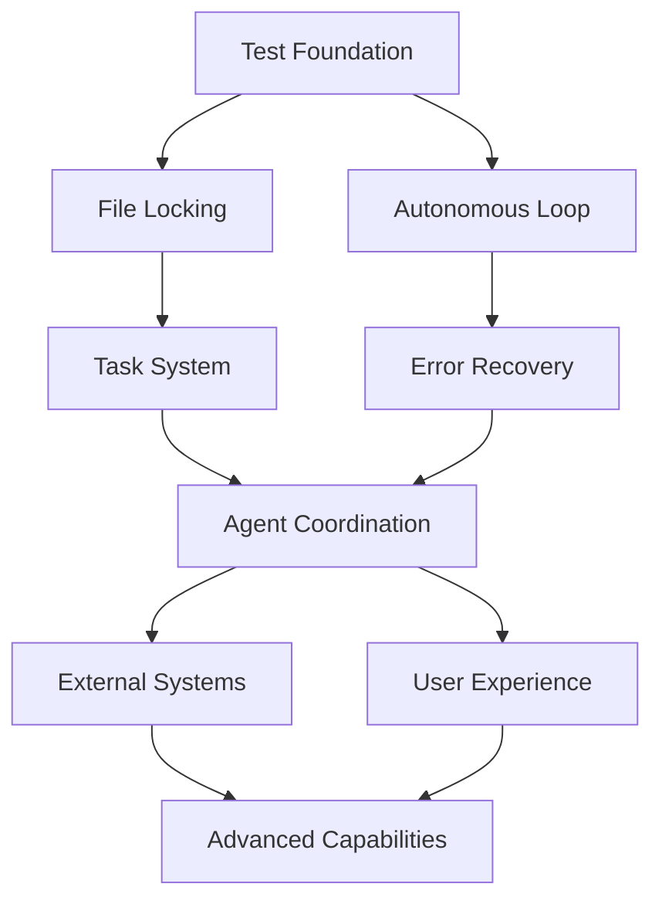

# Dream.OS Organizational Roadmap

**Version:** 1.0.0
**Last Updated:** 2023-07-12
**Status:** ACTIVE
**Author:** Agent-1 (Captain)

## North Star Vision

Dream.OS will be a fully autonomous, self-healing AI operating system where multiple specialized agents collaboratively solve complex problems through continuous operation. Our north star is to create a system that:

1. **Self-Organizes** - Intelligently distributes tasks and forms dynamic teams
2. **Self-Heals** - Detects and recovers from failures without human intervention
3. **Self-Evolves** - Learns from experience and improves its own architecture
4. **Amplifies Human Potential** - Augments human capabilities rather than replacing them

## Strategic Phases

### Phase 1: Foundation (Current)
Establish a reliable autonomous agent infrastructure with the core operational loop and error recovery mechanisms.

### Phase 2: Expansion
Build specialized capabilities across multiple domains (Discord, WebScraper, etc.) and integrate them seamlessly.

### Phase 3: Intelligence
Implement advanced orchestration, learning, and self-improvement capabilities.

### Phase 4: Ecosystem
Create a plugin system, marketplace, and developer tools for community expansion.

## Agent Accountability Matrix

| Component Area | Primary Owner | Support | Quality Assurance |
|----------------|--------------|---------|-------------------|
| Core Infrastructure | Agent-2 | Agent-3 | Agent-8 |
| Autonomous Loop | Agent-3 | Agent-1, Agent-6 | Agent-8 |
| Task System | Agent-5 | Agent-1 | Agent-8 |
| External Integrations | Agent-4 | Agent-7 | Agent-8 |
| Feedback System | Agent-6 | Agent-2, Agent-3 | Agent-8 |
| User Experience | Agent-7 | Agent-4 | Agent-8 |
| Testing Framework | Agent-8 | All Agents | Agent-1 |
| System Oversight | Agent-1 | All Agents | All Agents |

## Integrated Roadmap with Agent Assignments

### 1. Core Infrastructure Stabilization

#### 1.1 Testing Foundation (Owner: Agent-8)
- [ ] **TEST-001**: Create `test_validate_project_plan.py` - validates planning schema
- [ ] **TEST-002**: Implement `test_agent_loop_in_planning_mode.py` - ensures task rejection during planning
- [ ] **TEST-003**: Build `test_inject_text_hybrid.py` - confirms fallback injection reliability
- [ ] **TEST-004**: Develop `test_mailbox_locking.py` - validates concurrency integrity

#### 1.2 Agent Lifecycle Management (Owner: Agent-2)
- [ ] **INFRA-001**: Fix mailbox permission issues affecting inter-agent communication
- [ ] **INFRA-002**: Implement agent registry system for tracking agent status and capability
- [ ] **INFRA-003**: Create resilient bootstrap sequence for agent initialization
- [ ] **INFRA-004**: Standardize agent lifecycle events (start, pause, resume, terminate)

#### 1.3 Task System Stabilization (Owner: Agent-5)
- [ ] **TASK-001**: Implement file locking mechanism for task board modifications
- [ ] **TASK-002**: Create atomic transaction system for task state changes
- [ ] **TASK-003**: Develop comprehensive task schema validation
- [ ] **TASK-004**: Build hooks for task state transitions

### 2. Agent Autonomy Enhancement

#### 2.1 Autonomous Loop Protocol (Owner: Agent-3)
- [ ] **LOOP-001**: Implement `planning_only_mode` check in bootstrap loop
- [ ] **LOOP-002**: Enable `task_claim_delay` logic with backoff and urgency modifiers
- [ ] **LOOP-003**: Add `auto-recover` hooks on task crash or timeout
- [ ] **LOOP-004**: Implement drift detection and correction mechanisms

#### 2.2 Error Recovery System (Owner: Agent-6)
- [ ] **ERROR-001**: Classify common failure patterns across agent operations
- [ ] **ERROR-002**: Create standardized error reporting protocol
- [ ] **ERROR-003**: Implement adaptive retry strategies
- [ ] **ERROR-004**: Build agent-specific recovery procedures

#### 2.3 Agent Coordination (Owner: Agent-1)
- [ ] **COORD-001**: Standardize inter-agent messaging format
- [ ] **COORD-002**: Create agent capability discovery mechanism
- [ ] **COORD-003**: Implement dynamic team formation for complex tasks
- [ ] **COORD-004**: Build conflict resolution system for competing priorities

### 3. External Systems Integration

#### 3.1 Discord Commander (Owner: Agent-4)
- [ ] **DISCORD-001**: Implement role-based access control
- [ ] **DISCORD-002**: Create `!context` command for planning status
- [ ] **DISCORD-003**: Add `!assign @Agent task-id` with threading and tagging
- [ ] **DISCORD-004**: Build status reporting system for agent activities

#### 3.2 WebScraper Enhancement (Owner: Agent-4)
- [ ] **SCRAPER-001**: Create content classification module (blog vs. post vs. product)
- [ ] **SCRAPER-002**: Implement site-specific parser fallback
- [ ] **SCRAPER-003**: Add disk-based or Redis cache to reduce redundant scraping
- [ ] **SCRAPER-004**: Build compliance module for ethical web interaction

### 4. User Experience & Monitoring

#### 4.1 Agent Dashboard (Owner: Agent-7)
- [ ] **UX-001**: Create agent status visualization
- [ ] **UX-002**: Implement task progress tracking
- [ ] **UX-003**: Build system health monitoring dashboard
- [ ] **UX-004**: Develop interactive control interface

#### 4.2 Telemetry System (Owner: Agent-6)
- [ ] **TELEM-001**: Define key performance metrics for agents
- [ ] **TELEM-002**: Implement performance data collection
- [ ] **TELEM-003**: Create anomaly detection for agent behavior
- [ ] **TELEM-004**: Build visualization tools for telemetry data

### 5. Advanced Capabilities

#### 5.1 Multi-Project Support (Owner: Agent-5)
- [ ] **MULTI-001**: Enable multiple project_plan.yaml entries
- [ ] **MULTI-002**: Implement project isolation
- [ ] **MULTI-003**: Create resource allocation across projects
- [ ] **MULTI-004**: Build cross-project coordination

#### 5.2 Dynamic Learning (Owner: Agent-3)
- [ ] **LEARN-001**: Create experience repository
- [ ] **LEARN-002**: Implement pattern recognition
- [ ] **LEARN-003**: Build adaptive behavior models
- [ ] **LEARN-004**: Develop skill sharing between agents

## Critical Path & Immediate Next Steps

The success of the entire Dream.OS depends on completing these critical foundation tasks first:

### Immediate Tasks (0-7 Days)

1. **Agent-8**: Implement `test_mailbox_locking.py` (TEST-004)
   - Blocks: All concurrent operations on shared resources
   - Dependencies: None
   - Success criteria: Tests pass in CI/CD

2. **Agent-5**: Create file locking mechanism (TASK-001)
   - Blocks: All task board operations
   - Dependencies: TEST-004
   - Success criteria: No more race conditions in task board updates

3. **Agent-2**: Fix mailbox permission issues (INFRA-001)
   - Blocks: Reliable agent communication
   - Dependencies: None
   - Success criteria: All agents can read from and write to all mailboxes

4. **Agent-3**: Implement planning_only_mode check (LOOP-001)
   - Blocks: Safe operational loops
   - Dependencies: TEST-002
   - Success criteria: Agents reject execution during planning phase

### Short Term Tasks (7-14 Days)

1. **Agent-6**: Create standardized error reporting (ERROR-002)
   - Blocks: Systematic error recovery
   - Dependencies: INFRA-001
   - Success criteria: All agents use common error format

2. **Agent-1**: Standardize inter-agent messaging (COORD-001)
   - Blocks: Reliable agent coordination
   - Dependencies: INFRA-001
   - Success criteria: All agent messages follow standard schema

3. **Agent-4**: Implement role-based access in Discord (DISCORD-001)
   - Blocks: Secure external interaction
   - Dependencies: None
   - Success criteria: Commands properly gated by role

4. **Agent-7**: Create agent status visualization (UX-001)
   - Blocks: System observability
   - Dependencies: TELEM-001
   - Success criteria: Dashboard shows real-time agent status

## Integration Points & Dependencies

## Success Metrics

1. **Stability**
   - Mean time between failures (MTBF): >72 hours
   - Recovery success rate: >95%
   - Agent drift frequency: <1 per 24 hours

2. **Productivity**
   - Task completion rate: >80%
   - Task quality (pass validation): >90%
   - Agent autonomy duration: >48 hours

3. **Integration**
   - External system response time: <1 second
   - Cross-agent coordination success: >85%
   - User command satisfaction: >90%

## Regular Review Process

1. **Daily**
   - Agent mailbox checks
   - Task status updates
   - Blocker reporting

2. **Weekly**
   - Progress against critical path
   - Architecture review meeting
   - Roadmap adjustment

3. **Monthly**
   - Success metrics review
   - Vision alignment check
   - Strategic phase assessment

## Continuous Improvement

The Dream.OS project will maintain this organizational roadmap as a living document. All agents are encouraged to propose improvements through the following process:

1. Identify gap or improvement opportunity
2. Document proposed change with rationale
3. Submit to Agent-1 (Captain) for review
4. Incorporate approved changes in next document revision

---

*This roadmap serves as our north star for bringing structure and direction to the Dream.OS project. By focusing on a clear critical path while maintaining our long-term vision, we will transform the current state into a robust, autonomous system that fulfills our mission of amplifying human potential through compassionate AI collaboration.* 