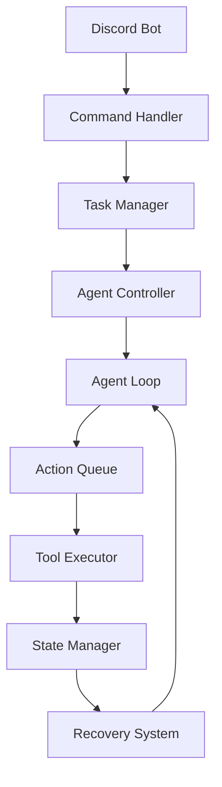
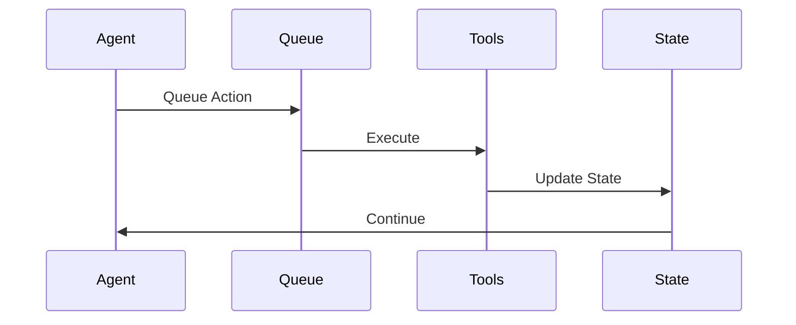
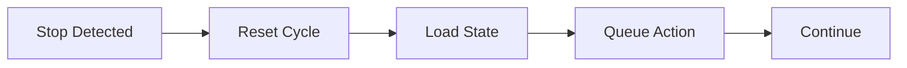

# System Architecture Diagrams

## Core Components

## Data Flow

## Recovery Flow

## Notes
- All components operate non-blockingly
- State is maintained continuously
- Recovery is automatic
- No human input required 